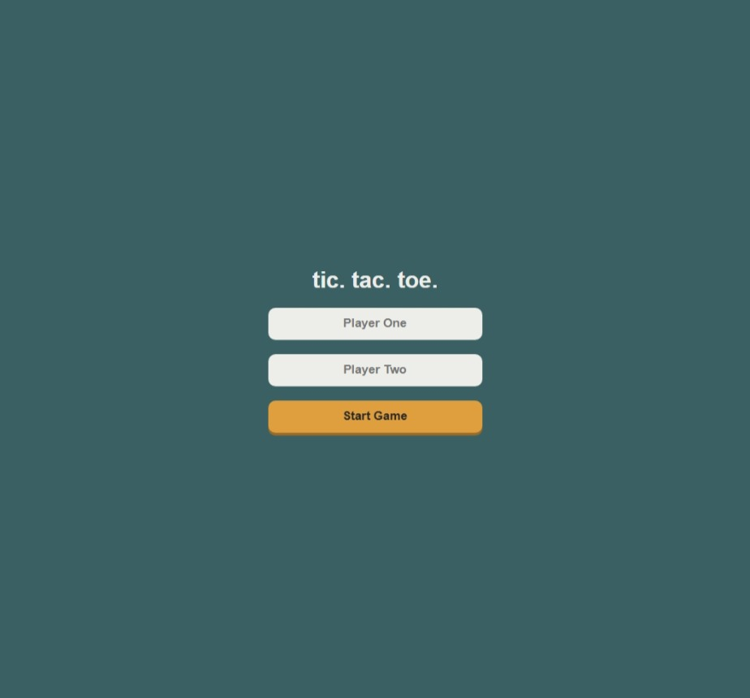
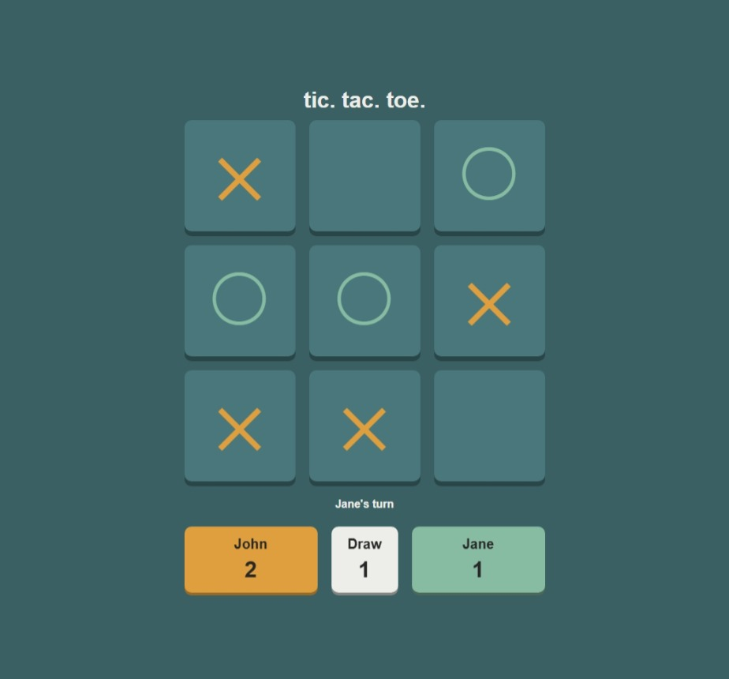

# ✖️⭕ Tic-Tac-Toe
This game of Tic-Tac-Toe was created in response to a project presented by The Odin Project.

Check out the live demo [here](https://ashmdavis.github.io/tic-tac-toe/).

**Built With:**
- `JavaScript`
- `CSS`
- `HTML5`

## Project Requirements

- Make use of factory functions and objects to keep the code clean and logical.
- Use as little global code as possible.

## 🚀 Features

- User name input.
- Scoreboard keeping track of each players score and draw score.
- Endless game rounds.
- A user interface that indicates player turn and states the winner of each round.

## ⏳ The Process

- Focusing on the project requirments, I started off with making the the basic functions of the game work before adding extra features or visuals. I started of with 3 functions. One for creating the players, one for creating the gameboard and the last for controlling the game flow.
- Using these functions, I was able to implement the basic mechanics of placing an "X" or and "O" onto the gameboard based on the player turn.
- After the basic mechanics were met I was able to add on basic score tracking.
- I used CSS and HTML to visualize instead of DOMs because I thought it to be unnecessaary since everything really only to be created once. Plus it allowed for a much cleaner code.

## 📸 Preview

| User Name Input | Gameboard |
| :---: | :---: |
|  |  |
